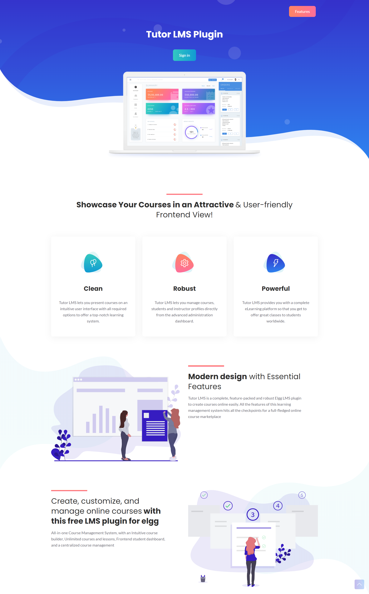

# Tutor LMS plugin for elgg

## Most Powerful LMS Plugin for elgg

Tutor LMS is a completely free elgg LMS plugin, compatible with the majority of elgg plugins. 

## Main Features

Tutor LMS plugin for elgg features:

- Easy course builder
- Unlimited courses
- Unlimited topics
- Frontend student dashboard
- Frontend teacher dashboard
- Teacher profiles
- Course management
- Course privacy 
- Q&A for students with course teacher
- Content Securit

Tutor LMS is a complete, feature-packed and robust Elgg LMS plugin to create courses online easily. 
All the features of this learning management system are fully compatible with any elgg plugin. You can create interactive assignments and 
unlimited courses. Tutor LMS is the only LMS plugin for elgg. Manage your education, online school, and online courses without having to write a single line of code.

## Getting Started

- Download or clone this repository/plugin
- Unzip it inside the mod folder
- Go to the plugins section, and activate it

## Features

### Elgg Roles

Tutor LMS implements two roles:

* #### Student role 
    * An extension of the standard elgg user role. You don't need to mark users as Students, because Tutor LMS extends this role behavior so that the student is limited to participate in class activities, assignments, etc. 

* #### Teacher role
    * Another extension of the standard elgg user role. Tutor LMS applies permissions to create classrooms, assignments, discussion topics, file uploads, etc., without complex administration. Just select the user account and mark it as a Teacher. 

### Tutor LMS plugin Addons 

Tutor LMS can be used by anyone looking to create a full-fledged learning management system. Some of the great applications of Tutor LMS include the following.

#### Assignments plugin integration
No need to install the stand-alone Assignments plugin. Tutor LMS already offers this feature out of the box

#### Miminium Administration Theme integration
A modern user interface, based on BootStrap, Javascript, CSS3, and ChartJS. It is a responsive device that will adapt to any device screen size.

#### Super River integration
No need to install the stand-alone Super River plugin to make your Feed look gorgeous. This feature is also provided by the Tutor LMS plugin. 

No more "boring" or "ancient-looking" feed. Forget about Moodle or Claroline and their complex set up. 
Tutor LMS carefully integrates the social aspect of Elgg and recreates the online classroom capabilities of the giants such as Google Classroom, Blackboard and Canvas

## To do

- Videolist integration
- Course topic feature
- Extra profile fields